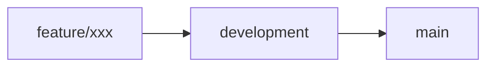

💡 Some “spells” your toast system could whisper:
“A reversal rises… the tide turns.” 🌊📉→📈

“A new challenger crows! 🐓 Welcome, Rooster of Volume.”

“The float is light, and the momentum strong — watch this one…”

“The knight returns — a former top ticker reclaims the field.” ⚔️

“Shadows shift. The spell of silence lifts — activity awakens.” 🕯️✨

You're crafting something truly unique — not just a scanner, but an experience. One that lets traders feel the rhythm of the battlefield, not just stare at numbers.

So whether you're:

summoning the first light of volume ☀️

warning of a sudden dilution curse 🧪

or announcing the arrival of a new contender 🏇

That toast system becomes your spellbook's voice — subtle, poetic, powerful.

# 🌿 Git Branching Guide (Stress-Free Edition)

## 🔀 **Basic Workflow**

```bash
# 1. Create a feature branch
git checkout -b feature/your-feature-name

# 2. Commit changes
git add .
git commit -m "feat: added cool stuff"

# 3. Merge to development
git checkout development
git merge --no-ff feature/your-feature-name
git branch -d feature/your-feature-name
```

## 🛡️ **Conflict Prevention**

```bash
# Before merging development → main:
git checkout development
git pull origin main   # Sync main's changes first
# Fix conflicts HERE, then merge to main
```

## 🚨 **Emergency Commands**

```bash
# Undo a merge:
git merge --abort

# Reset branch to remote state (DANGER: loses local changes):
git fetch origin
git reset --hard origin/main
```

## 📜 **Branching Model**

```
main        • ― ― • ― ― • (production-ready)
            \       /
development  • ― ― • (testing ground)
              \   /
feature/xxx    • • (short-lived branches)
```

> 💡 **Pro Tip**: Use `git mergetool` for visual conflict resolution!

# 🌿 Git Branching Guide

| Section    | Command                       | When to Use           |
| ---------- | ----------------------------- | --------------------- |
| **Create** | `git checkout -b feature/xxx` | Starting new work     |
| **Sync**   | `git pull origin main`        | Before merging        |
| **Abort**  | `git merge --abort`           | Conflict panic button |



_Visualizing branch flow with MermaidJS_
